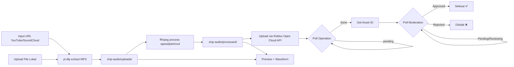

# VALENCY STUDIO

> **Konversi & Upload Audio ke Roblox** — By V.I.O.R

[](https://nextjs.org/)
[](https://www.typescriptlang.org/)
[](https://tailwindcss.com/)
[](https://www.prisma.io/)
[](https://discord.js.org/)
[](LICENSE)

Web app untuk mengekstrak audio dari YouTube / SoundCloud, memprosesnya dengan efek (speed, pitch, amplifikasi), dan meng-upload langsung ke Roblox via **Open Cloud API** — dilengkapi **Discord Bot** untuk monitoring server, notifikasi login, dan log aktivitas.

---

## Fitur

| Fitur | Keterangan |
|-------|-----------|
| **🎵 Multi-Source** | Tambah audio dari YouTube, SoundCloud, atau upload file (MP3, WAV, M4A, OGG, FLAC, AAC, WebM, Opus) |
| **⏩ Batch Processing** | Pilih banyak audio, proses sekali jalan dengan efek seragam |
| **🎛️ Efek Audio** | Speed (0.25x–4x), Pitch (±12 semitone), Volume (±20 dB) |
| **🛡️ Bypass Presets** | Preset rekomendasi (Pitch +2, Speed 1.08x, Nightcore, dll) hindari deteksi copyright Roblox |
| **☁️ Upload Roblox** | Upload langsung ke akun Roblox via Open Cloud API |
| **⏳ Auto Polling** | Polling otomatis status operation + moderasi asset |
| **📜 Riwayat** | Semua aktivasi tersimpan di SQLite, status moderasi terpantau |
| **🍪 Cookie Support** | Support Netscape cookies.txt untuk bypass "not a bot" YouTube |
| **🤖 Discord Bot** | Bot Discord terintegrasi — status server, log join/leave, notifikasi login, slash commands |
| **🔐 Discord OAuth** | Login via Discord langsung terintegrasi dengan NextAuth |

---

## Arsitektur

```
valencystudio/
├── src/
│   ├── app/
│   │   ├── page.tsx                  # Halaman utama (hero + 3 kolom grid)
│   │   ├── layout.tsx                # Root layout + metadata
│   │   ├── globals.css               # Tailwind + CSS variables
│   │   ├── proxy.ts                  # Next.js proxy (pengganti middleware.ts)
│   │   └── api/
│   │       ├── audio/
│   │       │   ├── extract/route.ts  # Ekstrak audio dari YT/SC/file
│   │       │   ├── process/route.ts  # Proses audio dgn ffmpeg
│   │       │   └── file/route.ts     # Stream file audio
│   │       ├── roblox/
│   │       │   ├── upload/route.ts   # Upload asset via Open Cloud
│   │       │   ├── status/route.ts   # Poll operation & moderasi
│   │       │   └── verify/route.ts   # Verifikasi API Key + UserID
│   │       ├── auth/[...nextauth]    # NextAuth endpoint handler
│   │       └── history/route.ts      # CRUD riwayat upload
│   ├── components/
│   │   ├── source-input.tsx          # Input multi-source
│   │   ├── bypass-recommendations.tsx# Preset bypass anti-deteksi
│   │   ├── preview-list.tsx          # List audio + waveform + checkbox
│   │   ├── processing-panel.tsx      # Slider speed/pitch/vol + batch
│   │   ├── roblox-panel.tsx          # Auth + upload + polling
│   │   ├── history-list.tsx          # Riwayat + status moderasi
│   │   ├── waveform-player.tsx       # Player audio dgn waveform
│   │   ├── theme-provider.tsx        # Dark/light mode
│   │   └── theme-toggle.tsx
│   ├── lib/
│   │   ├── audio-processor.ts        # yt-dlp extract + ffmpeg process
│   │   ├── roblox-api.ts             # Open Cloud API client
│   │   ├── store.ts                  # Zustand client state
│   │   ├── auth.ts                   # NextAuth config (Discord provider)
│   │   ├── db.ts                     # Prisma singleton
│   │   └── utils.ts                  # cn() helper
│   ├── discord-bot.ts                # Discord bot (login bersama web)
│   └── middleware.ts                 # Route protection (NextAuth JWT)
├── prisma/
│   └── schema.prisma                 # SQLite schema
├── scripts/
│   └── check-ytdlp.mjs              # Auto-update yt-dlp
├── mini-services/
│   └── audio-processor/              # Standalone audio processor (opsional)
├── .tmp-audio/                       # Audio files (gitignored)
│   ├── uploads/
│   └── processed/
├── bot-config.json                   # Persist ID pesan status Discord
├── Dockerfile                        # Multi-stage Docker build
├── Caddyfile                         # Reverse proxy config
├── render.yaml                       # Render deploy config
└── package.json
```

---

## Flow Aplikasi



---

## 🤖 Discord Bot

Bot Discord `ValencyStudio#8827` berjalan **bersamaan** dengan web server (`concurrently`). Bot otomatis login saat `bun run dev` / `bun run start`.

### Fitur Bot

| Fitur | Channel | Keterangan |
|-------|---------|-----------|
| **📊 Server Status** | `#👥・servers` | Embed stats real-time (member, presence, boosts), auto-update tiap 5 menit |
| **🔑 Login Log** | `#🟢・activity-check` | Notifikasi setiap user login via Discord OAuth di web |
| **📥 Member Join** | `#🟢・activity-check` | Log saat member baru masuk server |
| **📤 Member Leave** | `#🟢・activity-check` | Log saat member keluar server |

### Slash Commands

| Command | Deskripsi |
|---------|-----------|
| `/ping` | Cek latensi bot |
| `/status` | Force update embed status server |
| `/help` | Tampilkan daftar command |

Legacy prefix commands juga tersedia: `!ping`, `!status`.

### Konfigurasi Bot

Semua variabel di `.env`:

| Variabel | Keterangan |
|----------|-----------|
| `BOT_TOKEN` | Token bot dari [Discord Developer Portal](https://discord.com/developers/applications) |
| `GUILD_ID` | ID server Discord |
| `LOG_CHANNEL_ID` | Channel untuk log join/leave & login user |
| `STATUS_CHANNEL_ID` | Channel untuk embed status server |
| `WELCOME_CHANNEL_ID` | (Opsional) Channel untuk welcome message |

---

## 🔐 Discord OAuth (NextAuth)

Login web menggunakan **Discord sebagai OAuth provider** via NextAuth.js.

### Alur

1. User klik **Login with Discord** di `/login`
2. Redirect ke Discord OAuth consent — scope: `identify email guilds.join`
3. Callback menyimpan session (JWT), mengirim notifikasi ke channel Discord
4. Route protection via `middleware.ts` — redirect ke `/login` jika belum login

### Setup

1. Buka [Discord Developer Portal → Applications](https://discord.com/developers/applications)
2. Pilih aplikasi → **OAuth2 → General**
3. Tambahkan redirect: `http://localhost:3000/api/auth/callback/discord` (dev) / `https://domain.com/api/auth/callback/discord` (prod)
4. Copy **Client ID** → `AUTH_DISCORD_ID` di `.env`
5. Copy **Client Secret** → `AUTH_DISCORD_SECRET` di `.env`

---

## Persiapan

### Prasyarat

- [Node.js](https://nodejs.org/) ≥ 18
- [Bun](https://bun.sh/) (runtime & package manager)
- [ffmpeg](https://ffmpeg.org/) (tersedia di PATH)
- [yt-dlp](https://github.com/yt-dlp/yt-dlp) (binary di root project)

### Instalasi

```bash
# Clone
git clone https://github.com/rizkikotet-dev/valencystudio
cd valencystudio

# Install dependencies
bun install

# Generate Prisma client
bun run db:generate

# Push DB schema (buat SQLite db)
bun run db:push
```

### yt-dlp

Download binary dan taruh di root project:

**Windows:** `yt-dlp.exe`  
**Linux/macOS:** `yt-dlp` (executable)

```bash
# Linux
curl -L https://github.com/yt-dlp/yt-dlp/releases/latest/download/yt-dlp -o yt-dlp
chmod a+rx yt-dlp

# Atau gunakan script auto-update (jalan tiap dev/start)
bun run dev  # otomatis check & update
```

### Environment

Buat `.env` di root:

```env
# Database
DATABASE_URL="file:./db/prod.db"

# Discord OAuth (NextAuth)
AUTH_DISCORD_ID=your_client_id
AUTH_DISCORD_SECRET=your_client_secret

# NextAuth
AUTH_SECRET=generate_with_openssl_rand_base64_32
NEXTAUTH_URL=http://localhost:3000

# Discord Bot
BOT_TOKEN=your_bot_token
GUILD_ID=your_guild_id
LOG_CHANNEL_ID=your_log_channel_id
STATUS_CHANNEL_ID=your_status_channel_id
WELCOME_CHANNEL_ID=your_welcome_channel_id   # Opsional
```

---

## Menjalankan

Bot dan web server jalan **bersamaan** dalam satu perintah:

```bash
# Development (bot + web + auto-restart)
bun run dev

# Production build
bun run build

# Production start (bot + web)
bun run start
```

`bun run dev` menjalankan `concurrently`:
- **bot** → `bun src/discord-bot.ts`
- **web** → `yt-dlp check && next dev`

Akses web di `http://localhost:3000`

---

## API Endpoints

| Endpoint | Method | Deskripsi |
|----------|--------|-----------|
| `/api/audio/extract` | POST | Ekstrak audio dari URL YT/SC atau upload file (multipart) |
| `/api/audio/process` | POST | Proses audio dengan efek (speed/pitch/amplify) |
| `/api/audio/file` | GET | Stream file audio (range support) |
| `/api/roblox/verify` | POST | Verifikasi API Key + User ID Roblox |
| `/api/roblox/upload` | POST | Upload asset audio ke Roblox |
| `/api/roblox/status` | GET | Poll operation / moderation status |
| `/api/history` | GET/POST/PATCH | CRUD riwayat upload |
| `/api/auth/session` | GET | NextAuth session (JSON) |
| `/api/auth/signin` | POST | Login Discord OAuth |
| `/api/auth/signout` | POST | Logout |
| `/api/auth/csrf` | GET | CSRF token |

---

## Roblox Open Cloud API Setup

1. Buka [create.roblox.com/credentials](https://create.roblox.com/credentials)
2. Buat API Key baru dengan scope **Assets (Read+Write)**
3. Masukkan API Key + User ID Roblox di panel **Roblox Upload**
4. Klik **Verify** — app akan fetch profil dan validasi key

> **Catatan:** API Key disimpan hanya di client session (Zustand), tidak dikirim ke server selain ke Roblox API.

### Roblox Studio Normalization Script

Setelah upload, paste script ini di Roblox Studio untuk menormalkan audio yang sudah di-bypass:

```lua
-- Normalkan audio bypass agar terdengar seperti aslinya
local sound = script.Parent

sound.PlaybackSpeed = <dihitung otomatis>
sound.Volume = <dihitung otomatis>
```

App menampilkan script siap-paste di panel processing.

---

## Bypass Presets

| Preset | Speed | Pitch | Volume | Efektivitas |
|--------|-------|-------|--------|-------------|
| Original | 1x | 0 | 0 dB | — |
| Pitch +2 | 1x | +2 st | 0 dB | ⭐ Recommended |
| Pitch -2 | 1x | -2 st | 0 dB | ⭐ Recommended |
| Speed 1.08x | 1.08x | 0 | 0 dB | ⭐ Recommended |
| Pitch +1.5 & Speed 1.05x | 1.05x | +1.5 st | 0 dB | 🎯 Paling efektif |
| Nightcore | 1.25x | +4 st | 0 dB | 🌙 Bypass kuat |
| Subtle Mix | 1.03x | +1 st | +2 dB | ⭐ Recommended |

---

## Deploy

### Docker

```bash
# Build
docker build -t valency-studio .

# Run
docker run -p 3000:3000 -e DATABASE_URL="file:./db/prod.db" valency-studio
```

### Render (render.yaml)

Project siap deploy ke Render via Docker. Konfigurasi di `render.yaml`:
- Region: Singapore
- Disk 1GB untuk SQLite (`/app/prisma/db`)
- Plan: Free

### Caddy (reverse proxy)

`Caddyfile` sudah siap dengan dukungan query parameter `?XTransformPort=` untuk development.

---

## Database

SQLite via Prisma. Schema di `prisma/schema.prisma`:

**Models:**
- `RobloxAccount` — Akun Roblox yang terverifikasi
- `AudioUpload` — Riwayat konversi/upload (source, parameter, status moderasi)

```bash
# Push schema ke DB
bun run db:push

# Migrasi (development)
bun run db:migrate

# Reset DB
bun run db:reset

# Open Prisma Studio
bunx prisma studio
```

---

## Struktur Penyimpanan File

```
.tmp-audio/
├── uploads/       # File hasil ekstrak/upload mentah
└── processed/     # File hasil ffmpeg (siap upload)
```

File otomatis dibersihkan setelah 2 jam (`cleanupOldFiles()`).

---

## Teknologi

| Stack | Pustaka |
|-------|---------|
| **Framework** | Next.js 16 (App Router, Turbopack) |
| **Bahasa** | TypeScript |
| **UI** | Tailwind CSS 4, shadcn/ui (Radix primitives) |
| **Ikon** | Lucide React |
| **State** | Zustand (persist) |
| **Database** | SQLite + Prisma 6 |
| **Audio** | yt-dlp (extract), ffmpeg (process) |
| **Auth** | NextAuth.js v4 + Discord Provider (JWT) |
| **Discord Bot** | discord.js v14 (GatewayIntents: Guilds, GuildMembers, GuildMessages, MessageContent, GuildPresences) |
| **Runtime** | Bun 1.3 + concurrently |
| **Deploy** | Docker multi-stage, Render |
| **Proxy** | Caddy |

---

## Pengembangan

```bash
# Lint
bun run lint

# Build
bun run build

# Prisma Studio
bunx prisma studio
```

---

## Lisensi

MIT © V.I.O.R
